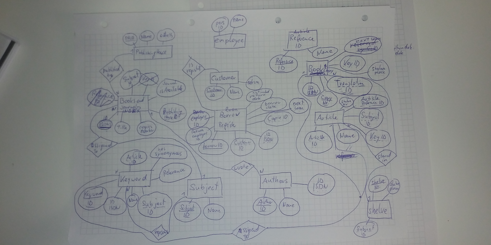

# Library-ERM
A library manages books and journals. Each book is published by a publishing house, 
there may be several copies of each book, which can also be borrowed by customers. 
There are published issues of the journals, these are only available once, a loan 
is not possible.
The articles published in the journals as well as the books should be managed in 
such a way that comfortable functions for information retrieval are possible: In 
addition to the assignment of a subject area, there should also be a keyword, 
whereby the relevance of each assigned keyword is important. Synonymous keywords 
should be recorded. Articles and books can each have several authors. Certain books 
can each have one book as a translation template, articles can reference each other:
Each borrowing is handled by one employee, and one employee is also responsible 
for returning the book copy.
Customers can also reserve books, each reservation usually results in a loan. 
The books and magazines are stored on shelves. A journal is placed on a shelf, 
and each shelf is assigned a subject area for the storage of the books.

#### Notes:

booksAndJournalsIndex(BAID: int, title:varchar(32), copies:int, PHID:int)  
book(BID:int, copyNumber:int, AuthorID:int, translationID:int, shelvePlace:int)  
journal(JID:int, title:varchar(32), shelveNumber:int)   
article(ArtID:int, title:varchar(32), AuthorID:int, subjectID:int, referenceArticleID:int, shelveNumber:int )  
author(AuthorID:int, name:varchar(32))
publishingHouse(PHID:int, name:varchar(32), address:varchar(32))  
customer(CID:int, name:varchar(32))  
employee(EID:int, name:varchar(32))  

loan(LID:int, BID:int, copyNumber:int, borrowedBy:int, reservedFor:int, borrowDate:date, returnDate:date, borrowEmployee:int, returnEmployee:int)  

keyword(KID:int, word:varchar(32), SID:int, relevance:int, hasSynonymous:)  
keywordSynonym(KID:int,SynonymID:int, SynonymWord:varchar(32))  
subject(SID:int, word:varchar(32))  
shelve(shelvePlace:int, shelveNr:int)

#### own ERM

#### group ERM

