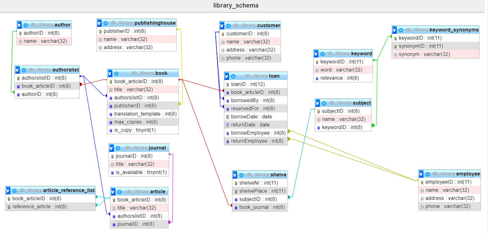

# Library-ERM
A library manages books and journals. Each book is published by a publishing house, 
there may be several copies of each book, which can also be borrowed by customers. 
There are published issues of the journals, these are only available once, a loan 
is not possible.
The articles published in the journals as well as the books should be managed in 
such a way that comfortable functions for information retrieval are possible: In 
addition to the assignment of a subject area, there should also be a keyword, 
whereby the relevance of each assigned keyword is important. Synonymous keywords 
should be recorded. Articles and books can each have several authors. Certain books 
can each have one book as a translation template, articles can reference each other:
Each borrowing is handled by one employee, and one employee is also responsible 
for returning the book copy.
Customers can also reserve books, each reservation usually results in a loan. 
The books and magazines are stored on shelves. A journal is placed on a shelf, 
and each shelf is assigned a subject area for the storage of the books.

### first solution

#### Notes:

booksAndJournalsIndex(BAID: int, title:varchar(32), copies:int, PHID:int) <br>
book(BID:int, copyNumber:int, AuthorID:int, translationID:int, shelvePlace:int) <br>
journal(JID:int, title:varchar(32), shelveNumber:int) <br> 
article(ArtID:int, title:varchar(32), AuthorID:int, subjectID:int, referenceArticleID:int, shelveNumber:int ) <br>
author(AuthorID:int, name:varchar(32))
publishinghouse(PHID:int, name:varchar(32), address:varchar(32)) <br>
customer(CID:int, name:varchar(32)) <br>
employee(EID:int, name:varchar(32)) <br>
loan(LID:int, BID:int, copyNumber:int, borrowedBy:int, reservedFor:int, borrowDate:date, returnDate:date, borrowEmployee:int, returnEmployee:int) <br>
keyword(KID:int, word:varchar(32), SID:int, relevance:int, hasSynonymous:) <br>
keywordSynonym(KID:int,SynonymID:int, SynonymWord:varchar(32)) <br>
subject(SID:int, word:varchar(32)) <br>
shelve(shelvePlace:int, shelveNr:int)

#### own ERM


#### group ERM


### second solution

#### ERM


#### textual notation

* book(**book_articleID**:int(8), title:varchar(32), *authorslistID*:int(8), *publisherID*:int(8),*translation_template*:int(8), max_copies:int(8), is_copy:boolean)
* journal(**journalID**:int(8), title:varchar(32), is_available:boolean)
* article(**book_articleID**:int(8), title:varchar(32), *authorslistID*:int(8), *journalID*:int(8))
* article_reference_list(***book_articleID***:int(8), ***reference_article***:int(8))
* authorslist(**authorslistID**:int(8), *book_articleID*:int(8),*authorID*:int(8))
* author(**authorID**:int(8), name:varchar(32))
* customer(**customerID**:int(8), name:varchar(32), address:varchar(32), phone:varchar(32))
* employee(**employeeID**:int, name:varchar(32), address:varchar(32), phone:varchar(32))
* publishinghouse(**publisherID**:int(8), name:varchar(32), address:varchar(32))
* loan(**loanID**:int(12), *book_articleID**:int(8), borrowedBy:int(8), *reservedFor*:int(8), borrowDate:date, returnDate:date, *borrowEmployee*:int(8), *returnEmployee*:int(8))
* subject(**subjectID**:int(8), name:varchar(32),keywordID:int(8))
* keyword(**keywordID**:int, word:varchar(32), relevance:int(8))
* keyword_synonyms(***keywordID***:int,**synonymID**:int, synonym:varchar(32))
* shelve(**shelveNr**:int(11), **shelvePlace**:int(11), *subjectID*:int(8),*book_journal*:int(8))


#### SQL

[Link SQL-file](db_library.sql)

```
CREATE TABLE book( book_articleID int(8), title varchar(32), authorslistID int(8), publisherID int(8), translation_template int(8), max_copies int(8), is_copy boolean, PRIMARY KEY(book_articleID));
CREATE TABLE journal( journalID int(8), title varchar(32), is_available boolean, PRIMARY KEY(journalID));
CREATE TABLE article( book_articleID int(8), title varchar(32), authorslistID int(8), journalID int(8), PRIMARY KEY(book_articleID));
CREATE TABLE article_reference_list( book_articleID int(8), reference_article int(8), PRIMARY KEY(book_articleID, reference_article));
CREATE TABLE authorslist( authorslistID int(8), book_articleID int(8), authorID int(8), PRIMARY KEY(authorslistID));
CREATE TABLE author( authorID int(8), name varchar(32), PRIMARY KEY(authorID));
CREATE TABLE customer( customerID int(8), name varchar(32), address varchar(32), phone varchar(32), PRIMARY KEY(customerID));
CREATE TABLE employee( employeeID int, name varchar(32), address varchar(32), phone varchar(32), PRIMARY KEY(employeeID));
CREATE TABLE publishinghouse( publisherID int(8), name varchar(32), address varchar(32), PRIMARY KEY(publisherID));
CREATE TABLE loan( loanID int(12), book_articleID int(8), borrowedBy int(8), reservedFor int(8), borrowDate date, returnDate date, borrowEmployee int(8), returnEmployee int(8), PRIMARY KEY(loanID));
CREATE TABLE subject( subjectID int(8), name varchar(32), keywordID int(8), PRIMARY KEY(subjectID));
CREATE TABLE keyword( keywordID int, word varchar(32), relevance int(8), PRIMARY KEY(keywordID));
CREATE TABLE keyword_synonyms( keywordID int, synonymID int, synonym varchar(32), PRIMARY KEY(keywordID, synonymID));
CREATE TABLE shelve( shelveNr int(11), shelvePlace int(11), subjectID int(8), book_journal int(8), PRIMARY KEY(shelveNr, shelvePlace));
```
